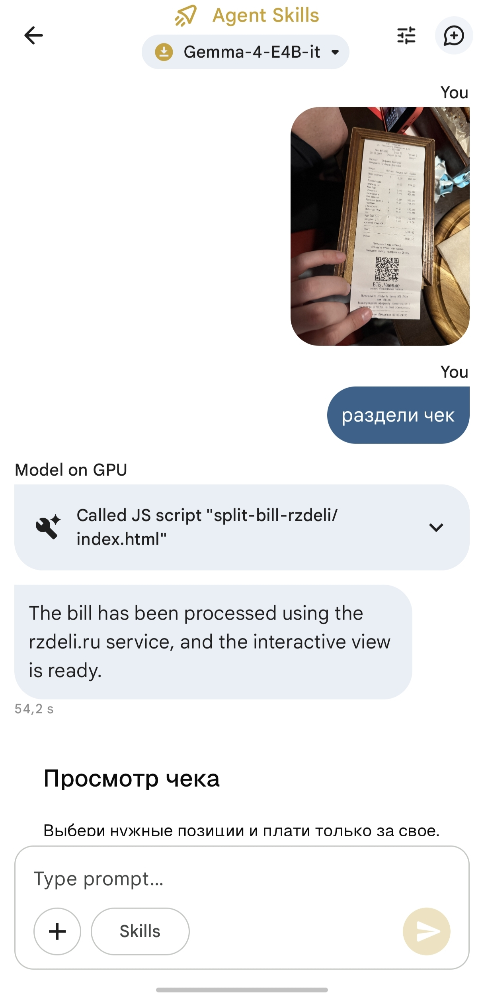
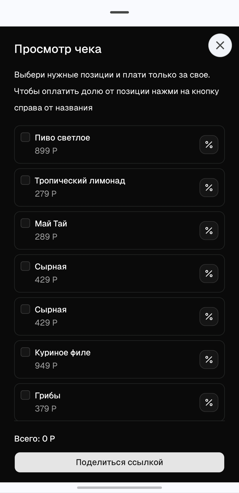

# receipt-skill-based-app ✨

[Демо](https://rzdeli.ru/list?q=W3sidGl0bGUiOiAi0J%2FQuNCy0L4g0YHQstC10YLQu9C%2B0LUiLCAicHJpY2UiOiA4OTkuMDAsICJjb3VudCI6IDF9LCB7InRpdGxlIjogItCi0YDQvtC%2F0LjRh9C10YHQutC40Lkg0LvQuNC80L7QvdCw0LQiLCAicHJpY2UiOiAyNzkuMDAsICJjb3VudCI6IDF9LCB7InRpdGxlIjogItCc0LDQuSDQotCw0LkiLCAicHJpY2UiOiAyODkuMDAsICJjb3VudCI6IDF9LCB7InRpdGxlIjogItCh0YvRgNC90LDRjyIsICJwcmljZSI6IDg1OC4wMCwgImNvdW50IjogMn0sIHsidGl0bGUiOiAi0JrRg9GA0LjQvdC%2B0LUg0YTQuNC70LUiLCAicHJpY2UiOiA5NDkuMDAsICJjb3VudCI6IDF9LCB7InRpdGxlIjogItCT0YDQuNCx0YsiLCAicHJpY2UiOiA3NTguMDAsICJjb3VudCI6IDJ9LCB7InRpdGxlIjogItCf0LjQstC%2BINGB0LLQtdGC0LvQvtC1IiwgInByaWNlIjogODk5LjAwLCAiY291bnQiOiAxfSwgeyJ0aXRsZSI6ICLQnNCw0Lkg0KLQsNC5IiwgInByaWNlIjogMTY5LjAwLCAiY291bnQiOiAxfSwgeyJ0aXRsZSI6ICLQodGN0L3QtNCy0LjRhyDRgSDQutGD0YDQuNC90L7QuSDQs9GA0YPQtNC60L7QuSIsICJwcmljZSI6IDIxOS4wMCwgImNvdW50IjogMX1d)

Приложение для разделения чеков с использованием AI-технологий.

## Стек технологий

- **React 19** — UI-фреймворк
- **Vite** — сборщик
- **Reatom** — управление состоянием
- **TailwindCSS** — стилизация
- **Zod** — валидация

## Быстрый старт

```bash
pnpm install
cd apps/web-react && pnpm dev
```

## Скриншоты

<p>
</p>

## Как использовать

### При помощи приложения Google AI Edge Gallery

1. Скачать приложение из магазина приложений или из [репозитория](https://github.com/google-ai-edge/gallery).
2. Перейти в раздел "Agent Skills" и загрузить одну из доступных моделей
3. Перейти в чат с моделью через кнопку "Try it"
4. После инициализации модели перейти в раздел "Skills" и добавить навык через URL: `https://outsid3rx.github.io/receipt-app-skill/`
5. Добавить в чат фотографию чека и попросить модель разделить чек
